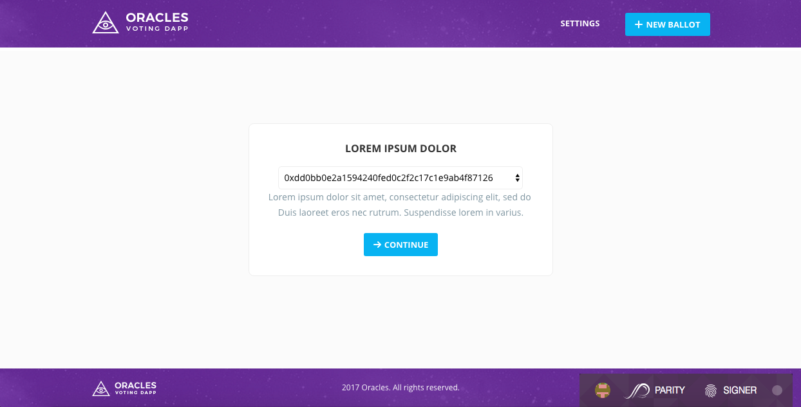
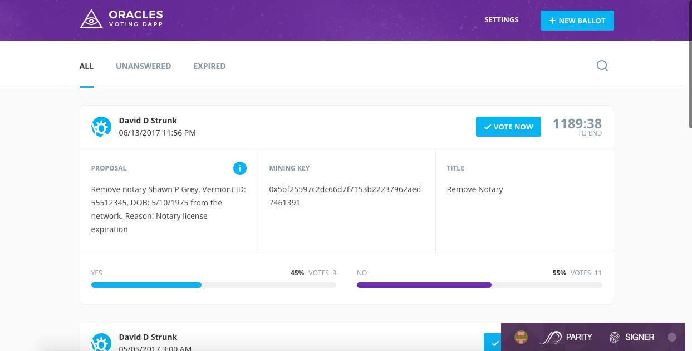
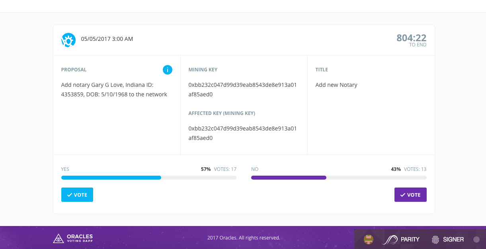
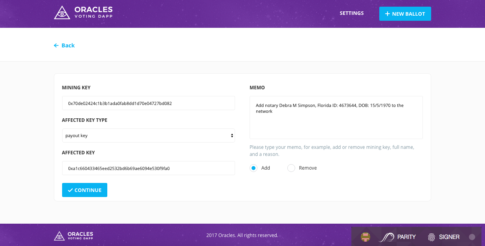

# Oracles network Voting Dapp

## Initial page (Settings)
Choose your voting key from the list to continue. You can return to this page from any page by clicking **Settings** button.



## Ballots page
You'll see the page with the list of all ballots. Here you can switch to see only your **UNANSWERED** or **EXPIRED** ballots. 
**Search** by ballots' data is available too.

Single ballot page is opened by clicking **VOTE NOW** button.



## Single ballot page
Here you can vote for or against notary. If total number of votes > 3, notary will be added or deleted from the network depending on votes majority after voting will be finished.



## New ballot page
Click **NEW BALLOT** button from any page to create a new ballot. 




## Configuration file
It is configured with [Oracles network contract](https://github.com/oraclesorg/oracles-contract)

Path: `./assets/javascripts/config.json`

```
{
  "environment": "live",
  "Ethereum": {
    "live": {
      "contractAddress": "Oracles_contract_address"
    }
  }
}
```

## Building from source

1) `npm install`

2) `npm run sass`

3) `npm run coffee`

4) `npm start`