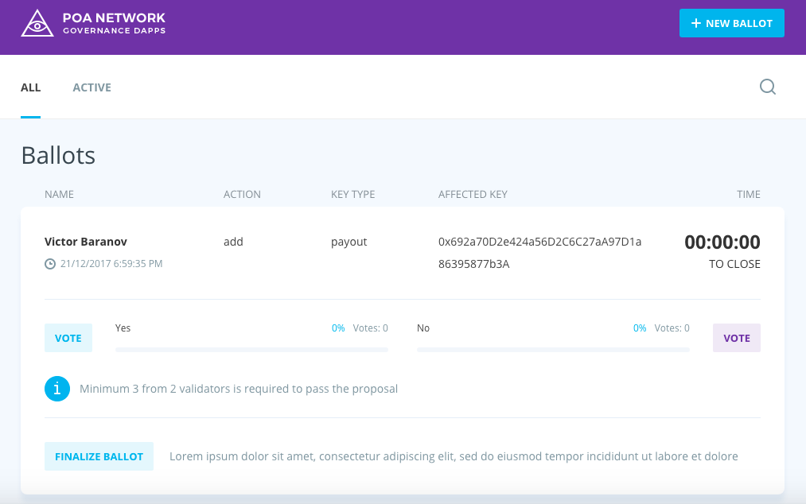
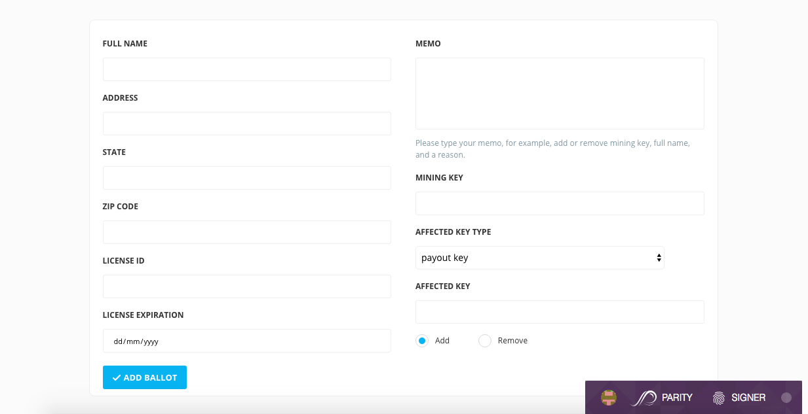

# POA Network Governance Dapp

## Supported browsers

* Google Chrome v 59.0.3071.115+

## MetaMask plugin setup

* Connect to POA Network in MetaMask plugin (See [Connect to POA Network via MetaMask](https://github.com/poanetwork/wiki/blob/master/MetaMask-connect.md#connect-to-poa-network-via-metamask))

* Import your voting key to MetaMask Plugin (See [Governance section from wiki](https://github.com/poanetwork/wiki/blob/master/governance.md)).

## Governance Dapp lifecycle

Check [Governance Dapp section from wiki](https://github.com/poanetwork/wiki/blob/master/governance.md)

## Ballots page
You'll see the page with the list of all ballots. Here you can switch to see **ACTIVE** ballots. 
**Search** by ballots' data is available too.




## New ballot page
Click **NEW BALLOT** button from any page to create a new ballot. 




## Configuration file
It is configured with [POA Network contract](https://github.com/poanetwork/poa-network-consensus-contracts)

Path: `./src/contracts/addresses.js`

```
module.exports = {
  KEYS_MANAGER_ADDRESS: '0xfc90125492e58dbfe80c0bfb6a2a759c4f703ca8',
    VOTING_TO_CHANGE_KEYS_ADDRESS: '0x49df4ec19243263e5db22da5865b4f482b8323a0',
    VOTING_TO_CHANGE_MIN_THRESHOLD: '0x8829ebe113535826e8af17ed51f83755f675789a',
    VOTING_TO_CHANGE_PROXY: '0x6b728399b41a38d4109f7af2213d4cc31ca87812',
    METADATA_ADDRESS: '0xcBB2912666c7e8023B7ec78B6842702eB26336aC',
    POA_ADDRESS: '0x8bf38d4764929064f2d4d3a56520a76ab3df415b',
    BALLOTS_STORAGE_ADDRESS: '0x0d7590c7aedf1e7e85fc9a1ee88f6f17d3ba762f'
}
```

## Building from source

1) `npm i`

2) `npm start`